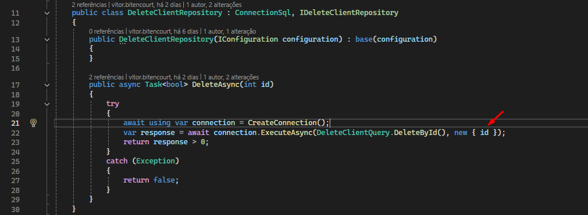
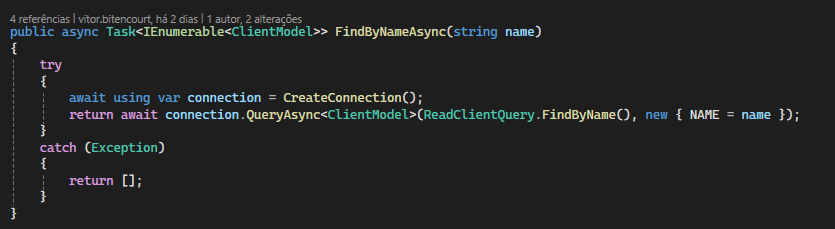

# ASM

Arquitetura de Software e Solução

## 📋 Sumário

- [Descrição](#descrição)
- [Estrutura do Projeto](#estrutura-do-projeto)
- [Pré-requisitos](#pré-requisitos)
- [Instalação](#instalação)
- [Scripts SQL](#scripts-sql)
- [Explicação Dapper](#explicação-dapper)
- [Contato](#contato)

---

## Descrição

Este projeto apresenta o desafio final da Pós-Graduação em Arquitetura de Software e Soluções.

---

## Estrutura do Projeto

- /Business.Contract       - Contratos de negócio
- /Business.Models         - Modelos de dados do domínio
- /Business.Shared         - Componentes compartilhados
- /Business                - Lógica de negócio principal
- /Repository.Contract     - Contratos de persistência
- /Repository.Models       - Modelos de dados para persistência
- /Repository              - Implementações de acesso a dados
- /XPedidos                - Módulo XPedidos
- /XPedidos.Infrastructure - Infraestrutura e integrações externas
- /Docs                    - Documentação (ex: scripts SQL)

---

---

## Pré-requisitos

- [.NET 8.0+](https://dotnet.microsoft.com/download)
- SQL Server 2008 ou superior
- Visual Studio 2022 ou superior

> **Atenção**: A compilação do release é gerada como auto-suficiente.

---

## Instalação

1. [Download do programa](https://github.com/DevsBitencourt/ASM/releases/download/1.0.2/ASM.zip)
2. Descompactar o arquivo `.zip`
3. No arquivo `appsettings.json`, alterar a `ConnectionString` para acessar o banco de dados
4. Executar o programa `XPedidos.exe` como administrador
5. A aplicação está configurada para subir na porta 7074, mas pode ser alterada através do `appsettings.json`
6. Após finalizar os passos acima, acessar o endpoint `/api-docs` através da rota gerada pela aplicação

### Opcional

Este projeto contém a implementação de middleware utilizando o Discord como repositório de logs. Para analisar o funcionamento:

1. Crie um webhook no Discord
2. Configure a propriedade `DiscordWebHook` no arquivo `appsettings.json`

---

## Scripts SQL

Os scripts para criação e manutenção do banco estão em `/Docs/Scripts.sql`.

Alternativamente, há um backup com alguns registros em `Docs/ASM1.bak`.

> **Atenção**: Use SQL Server 2008 ou superior para garantir compatibilidade.

---

## Explicação Dapper

### Exemplo de Execução

O Dapper utiliza métodos de extensão da conexão com o banco de dados. Na linha 22, ele estende a propriedade `connection` e disponibiliza o `ExecuteAsync`, onde:
- **Primeiro parâmetro**: comando SQL
- **Segundo parâmetro**: parâmetros da query

### Passagem de Parâmetros

O Dapper permite o uso de objetos dinâmicos para passagem de parâmetros. Neste exemplo, fornecemos `new { id }`. Dentro do comando SQL existe o parâmetro `@id`, e o Dapper realiza a passagem de parâmetro automaticamente, prevenindo SQL Injection.

### Exemplo de Leitura

Neste exemplo, informamos ao Dapper para carregar as informações do banco na classe `ClientModel`. O retorno de `QueryAsync<ClientModel>` é `IEnumerable<ClientModel>`.

Note a passagem de parâmetro `new { NAME = name }`, onde o nome do parâmetro na consulta é `@NAME`.

---

## Contato

- [LinkedIn Bitencourt](https://www.linkedin.com/in/vitor-bitencourt-dev/)
- Email: [vitor.bitencourt.vmb@gmail.com](mailto:vitor.bitencourt.vmb@gmail.com)
